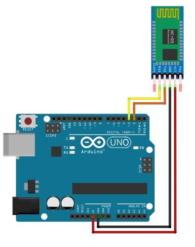

아두이노-Bluetooth모듈 시리얼 통신
================================
***
## 준비물

1. Arduino uno
2. Bluetooth모듈 : MLT-BT05
3. 점퍼케이블
***

## 전체 소스코드

```c++
#include <SoftwareSerial.h>

const int rxPin = 2;
const int txPin = 3;
const String LED_ON_CMD = "LEDON";
const String LED_OFF_CMD = "LEDOFF";
byte byteArray[10];
String myString;
int iter = 0;
int i = 0;

SoftwareSerial mySerial(rxPin, txPin); // RX, TX

void setup() {
  pinMode(LED_BUILTIN, OUTPUT);
  Serial.begin(9600);
  while (!Serial) {
    ;
  }

  Serial.println("Bluetooth Start!");
  mySerial.begin(9600);
}

void loop() {
  if (mySerial.available()) {
    byteArray[iter] = mySerial.read();
    iter++;
    myString = String((char*)byteArray);
    Serial.println(myString);
    if (myString.equalsIgnoreCase(LED_ON_CMD)){
        digitalWrite(LED_BUILTIN, HIGH);
        for(i = 0; i<10 ; i++){
            byteArray[i] = '\0';
          }
        iter = 0;
      }

    if (myString.equalsIgnoreCase(LED_OFF_CMD)){
        digitalWrite(LED_BUILTIN, LOW);
        delay(10000);
        for(i = 0; i<10 ; i++){
            byteArray[i] = '\0';
          }
        iter = 0;
    }
    //Serial.write(mySerial.read());
  }
  if (Serial.available()) {
    mySerial.write(Serial.read());
  }
}

```
***
## 연결도

***
## 소스 설명

- Serial통신 및 명령어 송수신을 위한 변수 선언
```c++
#include <SoftwareSerial.h>
const int rxPin = 2;
const int txPin = 3;
const String LED_ON_CMD = "LEDON";
const String LED_OFF_CMD = "LEDOFF";
byte byteArray[10];
String myString;
int iter = 0;
int i = 0;
SoftwareSerial mySerial(rxPin, txPin); // RX, TX
```


- Arduino의 LED를 끄고 켜는 명령어를 Bluetooth 통신으로 송신
- Arduino 기본 Serial통신 예제를 참고
```c++
void setup() {
  pinMode(LED_BUILTIN, OUTPUT);
  Serial.begin(9600);
  while (!Serial) {
    ;
  }
  Serial.println("Bluetooth Start!");
  mySerial.begin(9600);
}
```

- AT command를 이용해 BLE모듈 연결을 PIN없이 가능하도록 설정
- 안드로이드 Bluetooth 연결 기본 설정에서 연결이 되지 않아 *BLE 스캐너*를 이용하였음.


- 전달된 명령어는 byte로 전달되는데 이를 String으로 변환하여 대/소문자 상관없이 확인
- ledon이라고 보낼경우 LED가 켜지고, ledoff라고 보낼경우 LED가 꺼지는 간단한 로직
```c++
void loop() {
  if (mySerial.available()) {
    byteArray[iter] = mySerial.read();
    iter++;
    myString = String((char*)byteArray);
    Serial.println(myString);
    if (myString.equalsIgnoreCase(LED_ON_CMD)){
        digitalWrite(LED_BUILTIN, HIGH);
        for(i = 0; i<10 ; i++){
            byteArray[i] = '\0';
          }
        iter = 0;
      }

    if (myString.equalsIgnoreCase(LED_OFF_CMD)){
        digitalWrite(LED_BUILTIN, LOW);
        delay(10000);
        for(i = 0; i<10 ; i++){
            byteArray[i] = '\0';
          }
        iter = 0;
    }
    //Serial.write(mySerial.read());
  }
  if (Serial.available()) {
    mySerial.write(Serial.read());
  }
}
```
